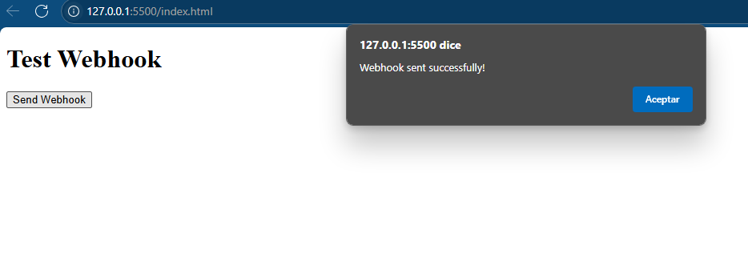
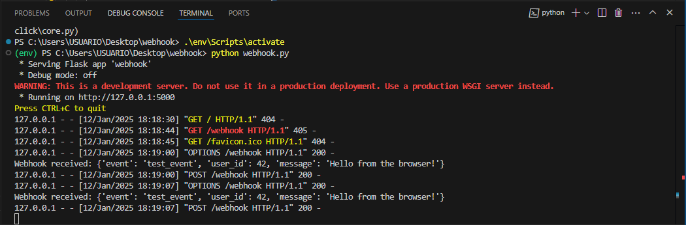

# Webhook Test with Flask and Browser 💻

This project demonstrates how to create a simple webhook that can be triggered from a browser by sending a POST request to a Flask server.

---

## **Project Description  🛠️**

- **Frontend:** HTML page with a button to trigger the webhook.
- **Backend:** Flask server that listens for POST requests at `/webhook`.
- **Functionality:** When the button on the frontend is clicked, the client sends a JSON payload to the server, which logs the event and sends a confirmation response.

---

## **Folder Structure  🛠️**

```plaintext
/project-folder
    index.html              # HTML file with the button to send the webhook
    webhook.py              # Flask server implementation
    /env                    # Folder for environment-related files (optional)
```

## **How to Run the Project ⚙️**
### Clone the repository

```bash
git clone <repository_url>
cd <project_folder>
```
## **Install the required dependencies**
Create a virtual environment (optional but recommended):
```bash
python -m venv env
.\env\Scripts\activate
```

## Run the Flask server:
```bash
mvn clean install
```
### Run the Application
```bash
python webhook.py
```
## Results pag
<p align="center">
  
</p>

## Results terminal
<p align="center">
  
</p>
